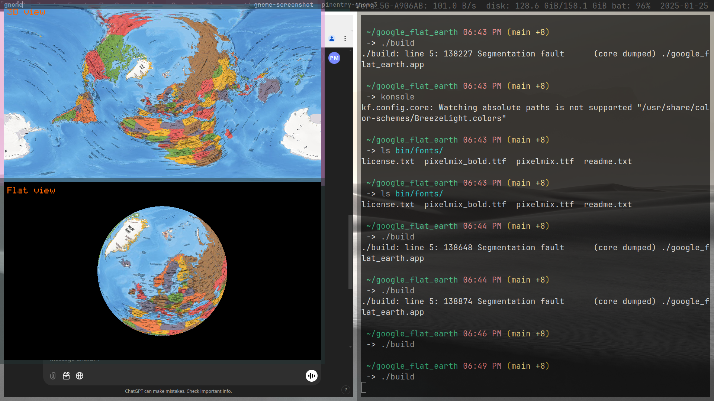
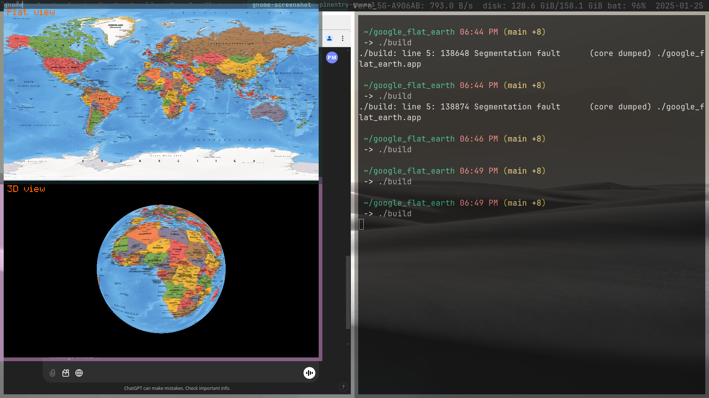
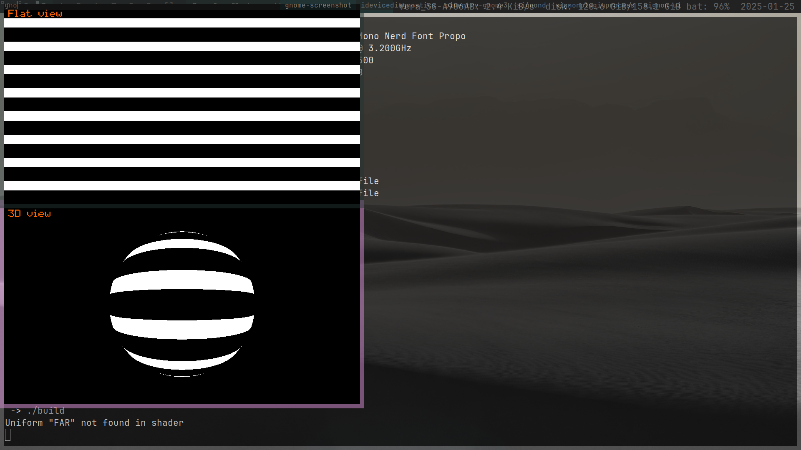
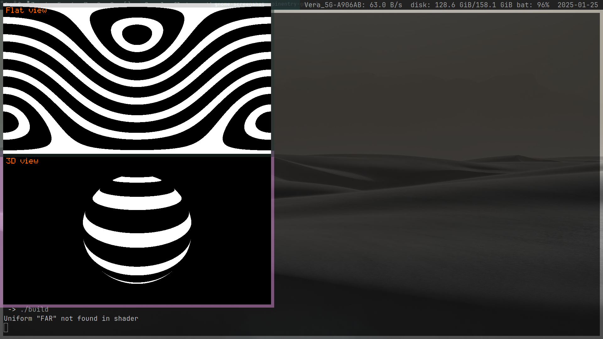
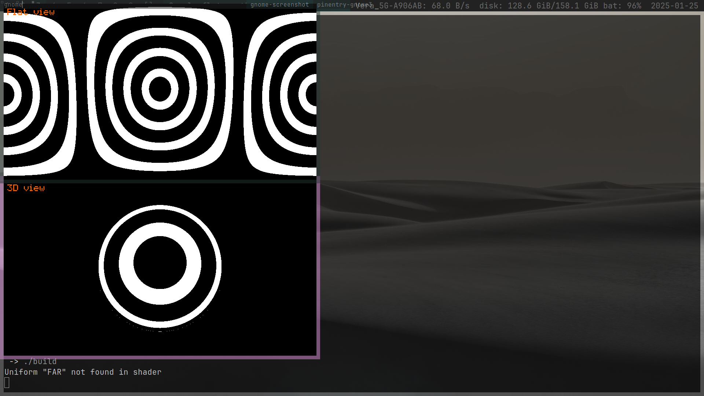

# The true size of / Google (Flat) Earth

It is a small, simple, C++/SFML which uses shaders to transform the texture of the Earth into both 3D and 2D from any POV.
This leads to a better understanding on how flat maps are deformed in order to fit a sphere into a rectangle. Also you can imagin how the world would look like for all humans if your country was the ritchest...

## Controls

Arrows to look arround and Space and Lshift to zoom out and in respectively.
Tab to hotreload the map, which must be .jpg.

## Building

on LINUX and MACOS

Unzip the DEPENDENCIES.zip (from the release) file onto the root. Then run `./build`.

on WINDOWS

Search for the dependencies at official pages of GLM and SFML and link them yourself, you pupcock.
Then run `g++ src/main.cpp -o google_flat_earth -Iinclude/ -Llib/ -lsfml-graphics -lsfml-window -lsfml-system` on MinGW.
